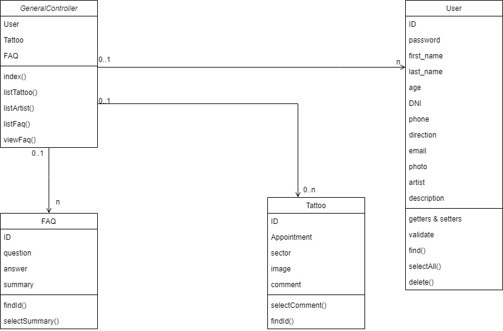
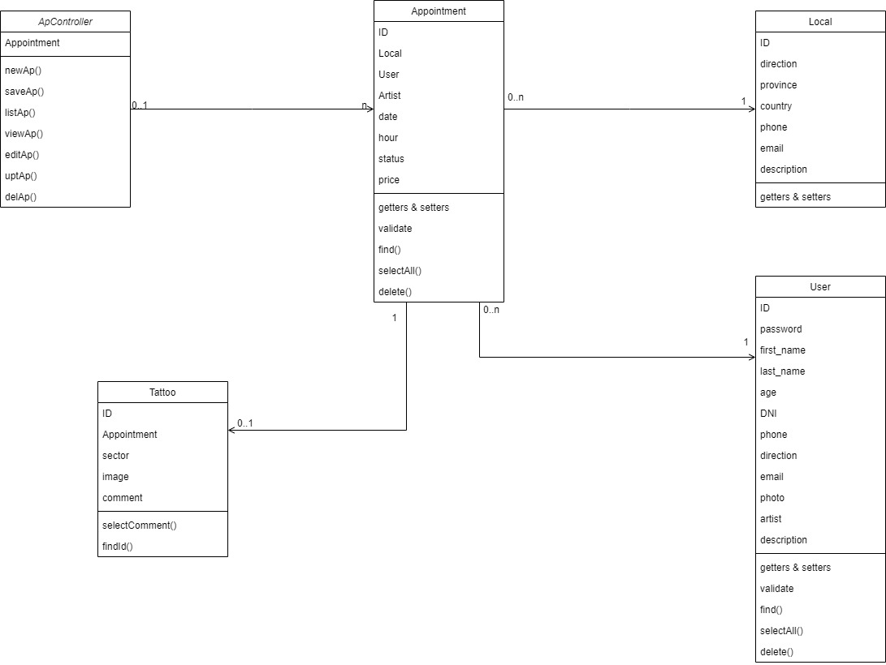
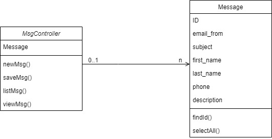

## Diagramas de clase

A continuacion se muestran las interacciones entre las vistas y los controladores:

### GeneralController
Las vistas que interactuan con el GeneralController son aquellas que solo son visualizaciones de información:
- index.html (Pantalla de home)
- list.sector.html (Pantalla de catalogo)
- list.tatto.html (Pantalla de catalogo de sector)
- list.artists.html (Pantalla de artistas)
- list.artist.html (Pantalla de artista específico)
- list.faq.html (Pantalla de preguntas frecuentes)
- view.faq.html (Pantalla de pregunta frecuente específica)

### UserController
Las vistas que interactuan con el UserController son aquellas que intercambian datos con la clase User:
- index.user.html (Pantalla de home del usuario)
- new.user.html (Pantalla de creación de nuevos usuarios)
- edit.user.html (Pantalla de edición del usuario)
- log.in.html (Pantalla de login del usuario)

### ApController
Las vistas que interactuan con el ApController son aquellas que intercambian datos con la clase Appointment:
- new.ap.html (Pantalla de creación de nuevos turnos)
- list.ap.html (Pantalla de visualización de los turnos)
- view.ap.html (Pantalla de visualización del turno específico)
- edit.ap.html (Pantalla de edición de turnos)

### MsgController
Las vistas que interactuan con el MsgController son aquellas que intercambian datos con la clase Message:
- new.msg.html (Pantalla de creación de nuevos mensajes en la sección de contactos)
- list.msg.html (Pantalla de visualización de los mensajes)
- view.msg.html (Pantalla de visualización del mensaje específico)

